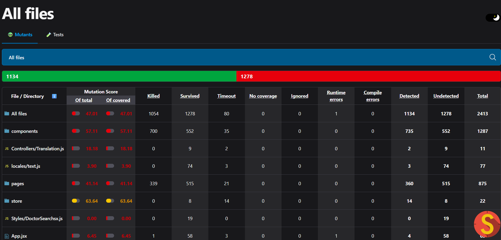
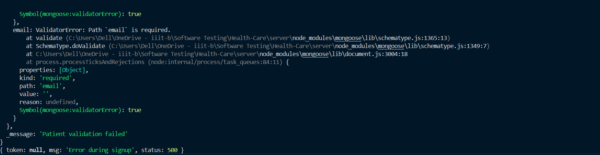
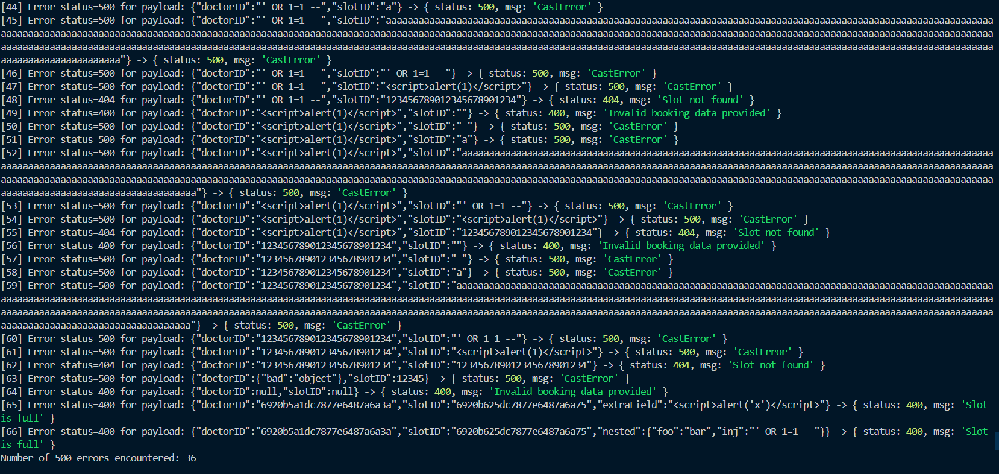

# Healthcare Application - Testing Documentation

## Table of Contents
- [Overview](#overview)
- [Testing Approach](#testing-approach)
- [Test Suites](#test-suites)
- [Mutation Testing](#mutation-testing)
- [Bypass Testing](#bypass-testing)
- [Execution](#execution)
- [Results](#results)

## Overview

React-based healthcare application with role-based workflows for patients and doctors, including authentication, video consultations, prescription management, and profile customization.

For website setup, see the detailed guide in the [Setup README](README-Setup.md).


**Testing Focus:**
1. Client and server-side mutation testing (Jest + Stryker)
2. Client and server-side bypass testing (Selenium + Axios)

## Testing Approach

### Unit Testing
Individual component testing for isolated functionality. 11 test files (client-side) and 6 test files (server-side) focus on specific components.

### Integration Testing
Multi-component tests implemented in `App.test.jsx` for the client side and `integration` folder for the server side.

### Mutation Testing
Fault-based testing using Stryker on critical JSX files and all the backend services to identify test suite gaps.

### Bypass Testing
Security validation through payload mutation to test input validation and error handling on both client and server.

## Test Suites

### Mutation Test Suites
**Location:** `client/src/__tests__/` - 104 total test cases

| Test Suite | Type | Focus Area |
|------------|------|------------|
| `App.test.jsx` | Integration | Routing, authentication, translation |
| `Appointments.test.jsx` | Unit | Appointment management, filtering |
| `DoctorDetails.test.jsx` | Unit | Profile fetching, booking |
| `DoctorNotificationFab.test.jsx` | Unit | Notifications, meeting management |
| `DoctorSearch.test.jsx` | Unit | Search, filters, parameters |
| `Login.test.jsx` | Unit | Authentication, token storage |
| `Meeting.test.jsx` | Unit | Video call lifecycle |
| `Navbar.test.jsx` | Unit | Navigation, role-based UI |
| `ProfileChange.test.jsx` | Unit | Patient profile updates |
| `ProfileChangeDoctor.test.jsx` | Unit | Doctor profile, scheduling |
| `ProfileDropDown.test.jsx` | Unit | Dropdown, logout |
| `Register.test.jsx` | Unit | Registration, validation |

**Location:** `server/tests` and `server/integration` - 85 total test cases
| Test Suite | Type | Focus Area |
|------------|------|------------|
| `AuthService.test.js` | Unit | Authentication |
| `AuthService.int.test.js` | Integration | Authentication |
| `BookingService.test.js` | Unit | Appointments, Prescriptions |
| `BookingService.int.test.js` | Integration | Appointments, Prescriptions |
| `DoctorService.test.js` | Unit | Doctor Info, Profile Update |
| `DoctorService.int.test.js` | Integration | Doctor Info, Profile Update |
| `MeetService.test.js` | Unit | View, Create, Delete Meeting |
| `MeetService.int.test.js` | Integration | View, Create, Delete Meeting |
| `HeartBeatService.test.js` | Unit | Monitor, Join Meeting |
| `HeartBeatService.int.test.js` | Integration | Monitor, Join Meeting |
| `UserService.test.js` | Unit | View, Update User Details |
| `UserService.int.test.js` | Integration | View, Update User Details |


### Bypass Test Suites
**Location:** `tests/`

**Client-Side:** `BlankRegister.test.js`
- Removes HTML `required` attributes via JavaScript
- Submits blank registration form
- Validates server-side rejection

**Server-Side:** `BookingTesting.test.js`
- Authenticates users via Selenium
- Extracts tokens from localStorage
- Generates 66 mutated booking payloads
- Tests API robustness with invalid data

**Mutation Variations:**
- Empty/whitespace strings
- Extremely long strings (500 chars)
- SQL injection patterns
- XSS payloads
- Invalid ObjectId formats
- Wrong data types (objects, numbers, null)
- Extra/nested fields

## Mutation Testing

### Client-Side

#### Setup
- **Config:** `client/stryker.config.mjs`
- **Mocks:** `client/test/__mocks__/` (CSS files)
- **Setup:** `client/jest.setup.js` (imports `@testing-library/jest-dom`)

#### Key Findings
- ~50% mutation kill rate
- Tested important JSX files only
- Translation code produced many surviving mutants
- Most survivors presumed equivalent mutants

### Server-Side

#### Setup
- **Config:** `server/stryker.conf.js`
- **Setup:** `client/jest.config.js`

#### Key Findings
- ~71% mutation kill rate
- Tested services files only

## Bypass Testing

### Client-Side
**Technology:** Selenium WebDriver (Chrome)  
**Target:** Registration form validation bypass  
**Method:** JavaScript injection to remove HTML validation attributes

### Server-Side
**Technology:** Selenium + Axios  
**Target:** Booking API endpoint robustness  
**Method:** Payload mutation to test state validation

**Test Process:**
1. Authenticate two patients via frontend (Selenium)
2. Extract authentication tokens
3. Authenticate as doctor via API
4. Retrieve valid doctor/slot IDs
5. Generate 66 mutated payloads
6. Send PUT requests to `/booking`
7. Log responses and count errors

**Result:** 36/66 payloads returned HTTP 500, validating proper error handling

## Execution

### Prerequisites
```bash
npm install
```

### Run Tests

#### Client Side
```bash
# All Jest tests
npx jest

# Specific test file
npx jest src/__tests__/App.test.jsx

# With coverage
npx jest --coverage

# Mutation testing
npx stryker run
```
#### Server Side
```bash
cd server

# All Jest tests
npm test

# Mutation testing
npx stryker run
```

### Run Bypass Tests
```bash
# Start servers first:
# Frontend: http://localhost:5173
# Backend: http://localhost:3000

# Client-side bypass
node tests/BlankRegister.test.js

# Server-side bypass
node tests/BookingTesting.test.js
```

## Results

### Mutation Testing (Client-Side)
- **Total Tests:** 104
- **Mutation Score:** ~50%
- **Coverage:** Important JSX files

### Mutation Testing (Server-Side)
- **Total Tests:** 85
- **Mutation Score:** ~71%
- **Coverage:** All backend services

- **Note:** Translation logic and equivalent mutants account for survivors and upon running stryker it generates a detailed report in `client/report/` (for client-side) and `server/report/` (for server-side) in html format which can be opened in any browser to see detailed results.

### Bypass Testing

**Client-Side:**
- ✓ Server correctly rejects empty registration submissions
- ✓ Backend validation independent of client-side attributes

**Server-Side:**
- **Total Mutated Payloads:** 66
- **HTTP 500 Responses:** 36 (54.5%)
- **Validation:** Proper rejection of invalid booking states

## Images

### Mutation Testing Coverage

*Stryker dashboard showing mutation scores and killed/survived mutants for client files.* 


*Stryker dashboard showing mutation scores and killed/survived mutants for server files.* 

### Bypass Testing Validation

*Terminal output with API error responses from bypass payload tests.*



*Server error trace for missing required email field during signup.* 


### Directory Structure
```
client/
├── src/
│   └── __tests__/          # 104 mutation test cases
├── test/
│   └── __mocks__/          # CSS mocks
├── jest.setup.js
└── stryker.config.mjs

server/
├── integration             # Integration Tests
│
├── tests                   # Unit Tests
│
├── jest.config.js
└── stryker.conf.js

testImages/            # Screenshots for README

bypass-tests/
├── BlankRegister.test.js   # Client bypass
└── BookingTesting.test.js  # Server bypass
```

---

## Usage of AI

AI tools were actively used to enhance this project's documentation and test code quality. The comments within `.test.js` files were primarily written with the assistance of AI, improving clarity and consistency. While the design of test cases and test logic was mainly my own, GitHub Copilot was sometimes leveraged to generate and suggest code for certain test cases. Additionally, this README's structure and formatting were organized with AI guidance based on content I provided, giving credit for the polished layout and presentation to AI tools.

## Contribution

Sai Venkata Sohith Gutta(IMT2022042) 
Siddharth Reddy Maramreddy (IMT2022031)

